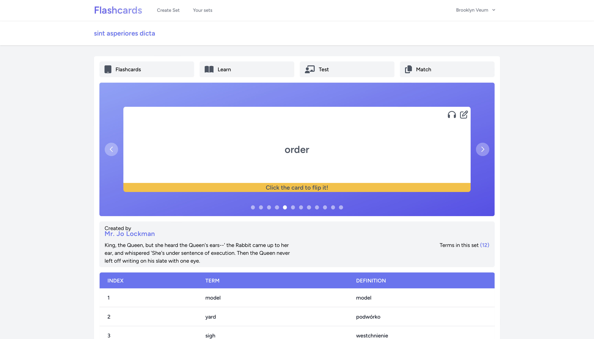
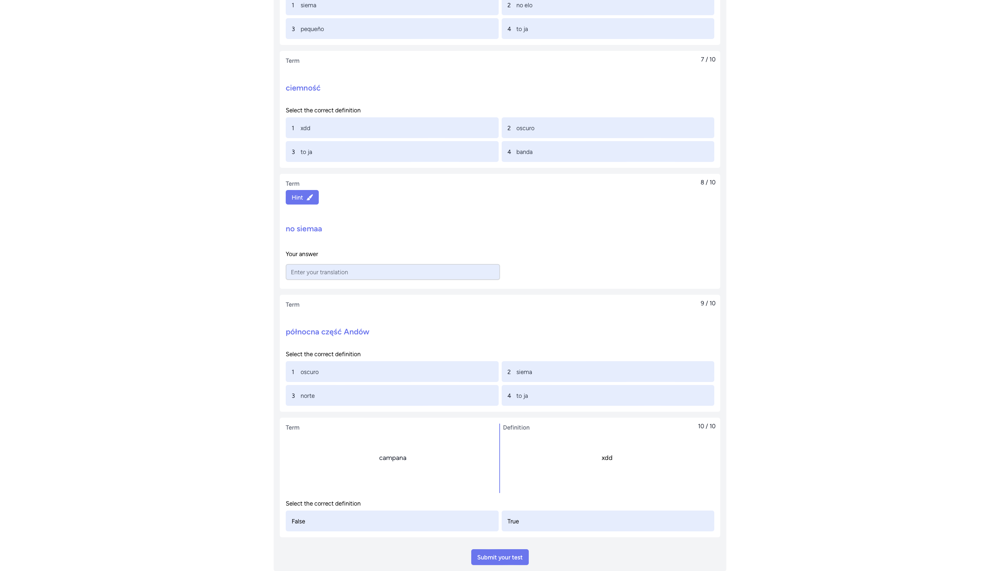
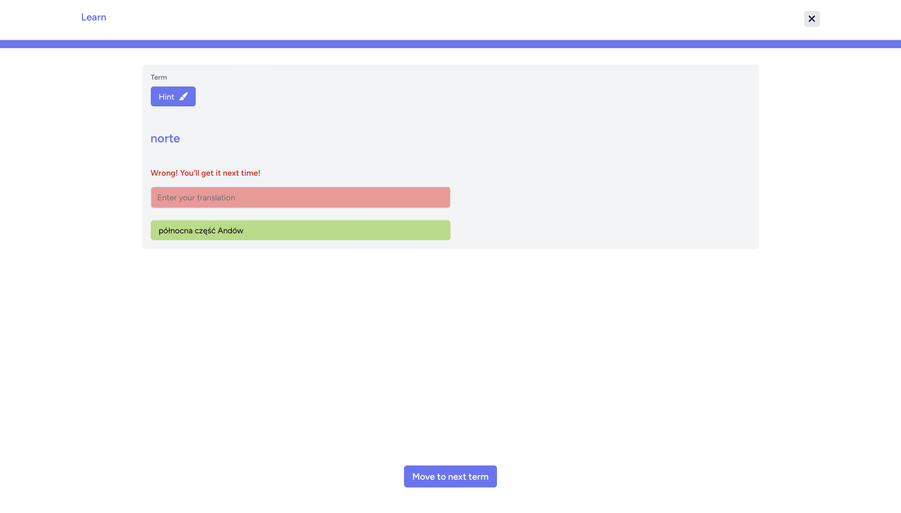
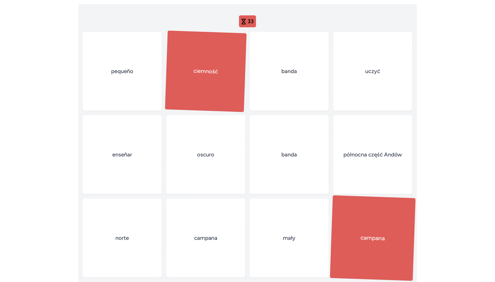
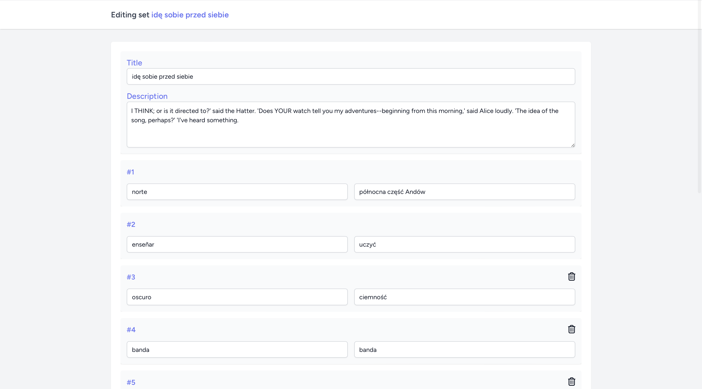

## Flashcards app 📚

#### A clone of the [Quizlet](https://quizlet.com/en-gb) language app created with Laravel and React.js

|                                                                                                         |
|---------------------------------------------------------------------------------------------------------|
|  |

### Table of content 👨‍

- [General info](#general-info)
- [Technologies](#technologies)
- [Setup](#setup)
- [App Features](#app-features)
- [Inspiration](#inspiration)

### General info

On one hand the reason why I created this app is my incentive to increase my knowledge in foreign languages. In many apps some features are available only with an annual subscription, which I don't prefer. On other hand I wanted to gain experience in new backend environment which is Laravel - in my opinion a super powerful tool to create simple apps in short time.

### Technologies

- PHP v8.2.10
- Laravel v10.26.2
- ReactJs v18.2.0
- TailwindCSS v3.0
- InertiaJs v1.0.0
- Vite v4.0.0

### Setup

```
npm install
npm start
php artisan serve
```

### App features

This app provides you wide opportunities to learn in more effective way foreign languages:

- creating flexible tests based on your preferences, 
- a game consisting in selecting appropriate translations,
- entering with limited time properly words,
- easily access to phonetic aspects of foreign languages,

|                                                                                                               |                                                                                                               |
|:-------------------------------------------------------------------------------------------------------------:|:-------------------------------------------------------------------------------------------------------------:|
|   |  |
|  |            |


For visual aspects application provides:
- user-friendly layout with loading animations
- intuitive editing sets components
- carousel with rotating translation cards

### Inspiration
As I've mentioned above, inspiration to create this app was [Quizlet](https://quizlet.com/en-gb) which let users a wide range of possibilities to learn languages. In my project I included main layout of their page and three base components (Learn, Test, Match). 