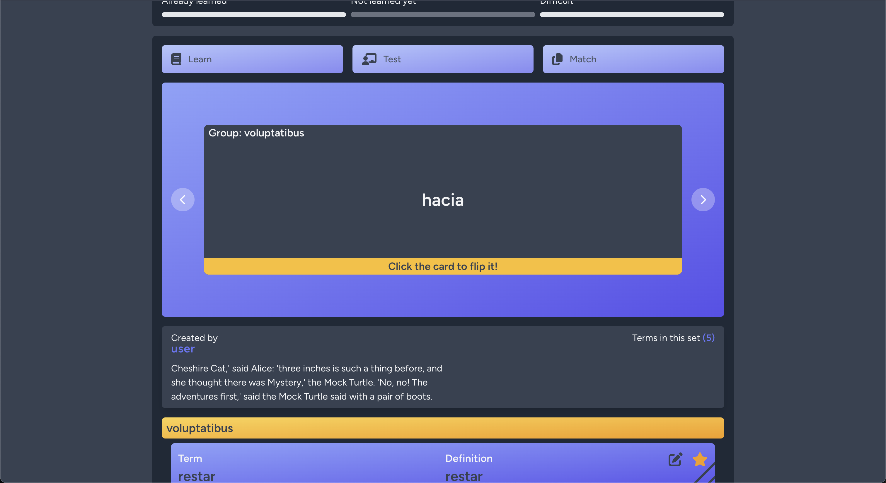
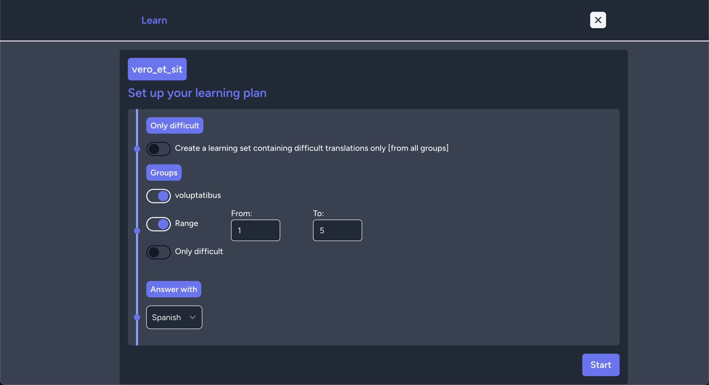
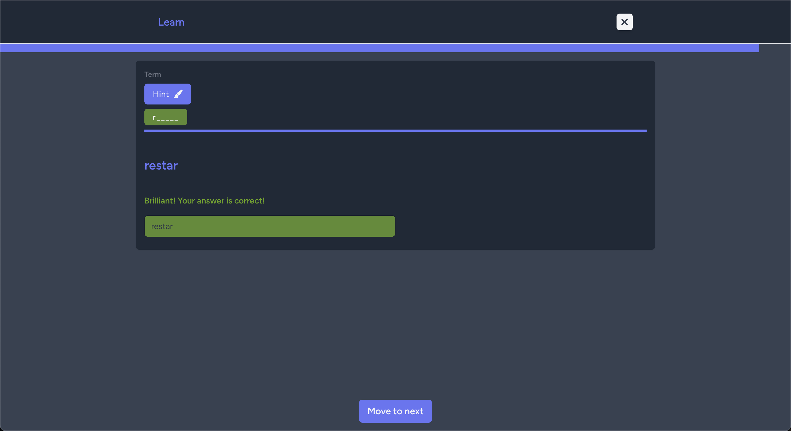
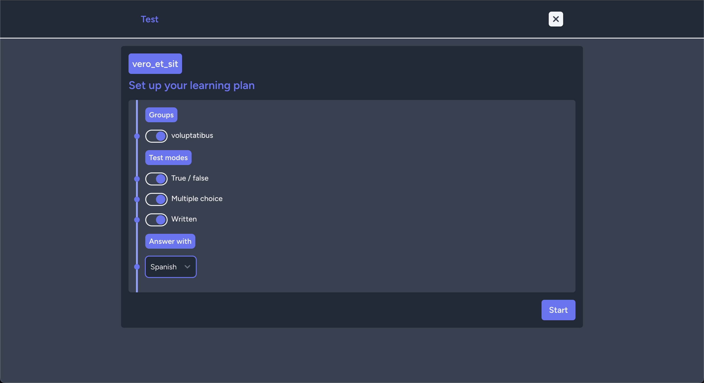
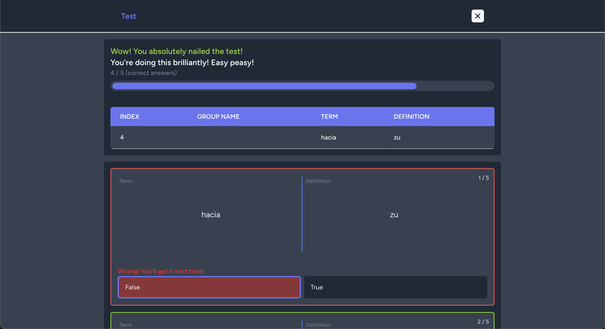
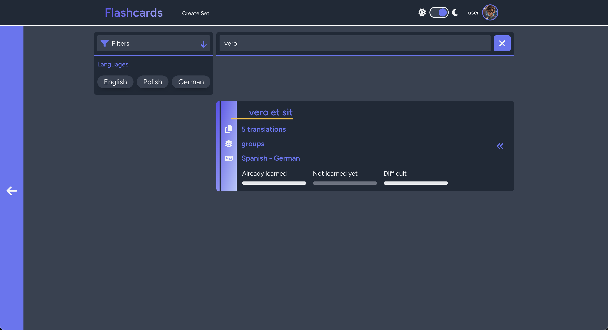
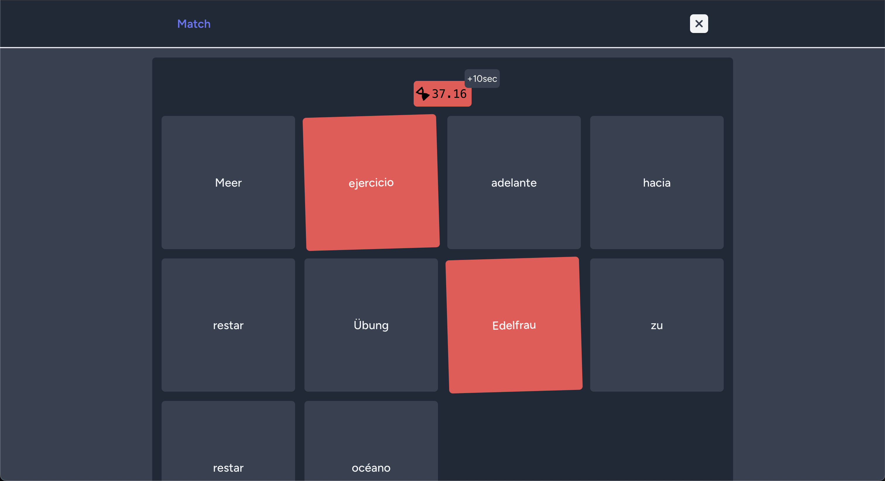
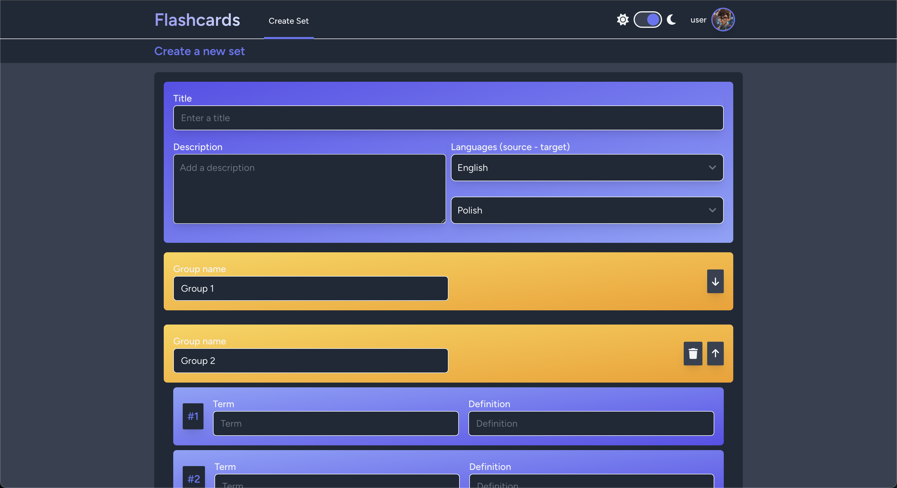
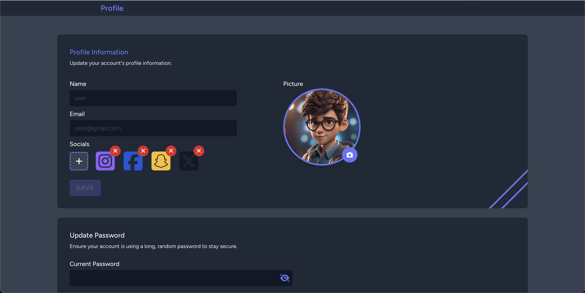

## Flashcards app 📚

A language-learning app inspired by [Quizlet](https://quizlet.com/en-gb), built with **Laravel** and **React**. Designed to assist users in learning and memorizing foreign languages through flashcard-based games and quizzes. Completely free and open source, it focuses on delivering an intuitive, customizable, and engaging experience.

|                                                                                                                              |
|------------------------------------------------------------------------------------------------------------------------------|
|  |

### Table of content 👨‍

- [Key features](#key-features)
- [Tech Stack](#tech-stack)
- [Gallery](#gallery)
- [Installation](#installation)
- [Contribution](#contribution)

### Key Features

This app provides you wide opportunities to learn in more effective way foreign languages:

- **Custom Flashcards** - create personalized flashcards for any language.creating flexible tests based on your preferences,
- **Intelligent Learning Sets** - automatically generate learning sets based on user difficulties, focusing on problematic words from previous spelling or translation attempts.
- **Test Modes** - challenge yourself with translation quizzes, spelling tests, and more.
- **Game-Like Interface** - interactive design with animations and a smooth user experience.
- **Time-Based Challenges** - improve retention with timed exercises.
- **Phonetics Support** - Access phonetic transcriptions to improve pronunciation.

### Tech Stack

- **Backend**: Laravel v10.26.2, PHP v8.2.10
- **Frontend**: React v18.2.0, InertiaJS v1.0.0, TailwindCSS v3.0
- **Build Tools**: Vite v4.0.0

### Installation

1. Clone the repository:
    ```
   git clone https://github.com/kamilekrawczyk404/Flashcards.git
   ```
2. Install dependencies:
    ```
    npm install
    composer install
    ```
3. Set up the environment:
    ```
   cp .env.example .env
    php artisan key:generate
   ```
4. Run the development server:
    ```
    npm run dev
    php artisan serve
    ```

### Gallery


|                                                                                                                                                                                                                                                                                                                                                                                                                                                                                                                                                                                                                                               |                                                                                                                            
|:---------------------------------------------------------------------------------------------------------------------------------------------------------------------------------------------------------------------------------------------------------------------------------------------------------------------------------------------------------------------------------------------------------------------------------------------------------------------------------------------------------------------------------------------------------------------------------------------------------------------------------------------:|
|                                                                                                                                                                                                                                                                                                                                                                                    |
|                                                                                                                                                                                                                                                                                                                                                                                           |
|
|                                                                                                                                                                                                                                                                                                                                                                                                                  |
|
|                                                                                                                                                                                                                                                                                                                                                                                                   |


### Contribution
Feel free to submit issues, create pull requests, or suggest new features!